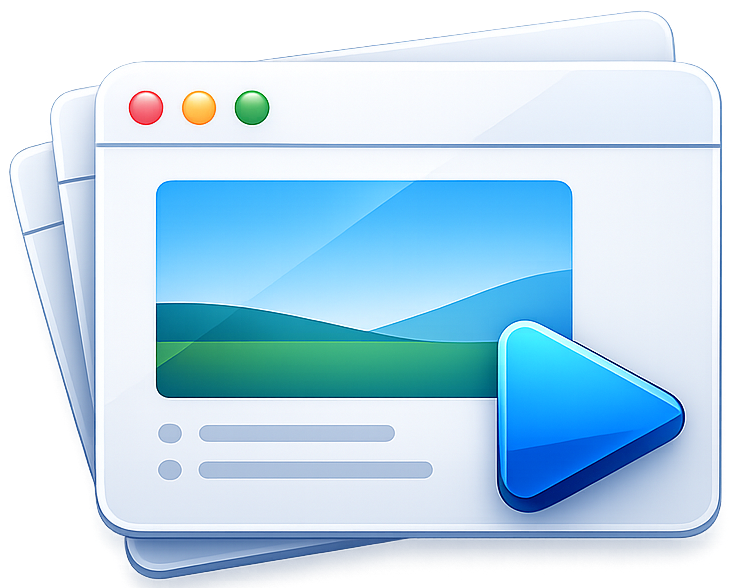

# Present

<div align="center">
  
</div>

A macOS SwiftUI app for giving presentations where each slide is a URL displayed in a WebView.

**🔧 Enhanced Fork** - This is an improved version of the original [Present](https://github.com/simonw/present) with additional features for better presentation management.

> [!NOTE]
> Original app was vibe coded as a demo for a conference. This fork adds professional presentation management features including display names for slides, multiple presentation lists, and improved keyboard navigation.

## Features

### Original Features
- **Edit mode**: Split view with a sidebar for managing URLs and a WebView preview panel
- **Play mode**: Fullscreen WebView with arrow key navigation (wraps around)
- **Auto-persist**: URL list saves automatically and restores on relaunch
- **File I/O**: File > Open/Save As for plain text files (one URL per line)
- **Zoom**: Cmd+=/- to adjust text size in both preview and fullscreen
- **Drag to reorder**: Drag slides by their number to rearrange
- **Image slides**: URLs ending in `.png`, `.gif`, `.jpg`, `.jpeg`, `.webp`, or `.svg` render as full-window images
- **Remote control**: Embedded HTTP server on port 9123 serves a mobile-friendly page with next/prev, play/stop, zoom, and scroll controls

### Enhanced Features (This Fork)
- **Display Names**: Add custom names to each slide (different from the URL) for better organization
- **Multiple Presentation Lists**: Save and manage multiple lists of presentations within the app
- **Safe Editing**: Modal dialog for editing slides instead of inline editing to prevent accidental changes
- **Improved Navigation**: Use Cmd+↑/Cmd+↓ to navigate between slides in presentation mode without interfering with web page interactions
- **Persistent Lists**: Automatically saves the last presentation list used, so it reopens where you left off
- **Better Organization**: Easily switch between presentation lists with a dropdown selector in the sidebar
- **Clicker Support**: Page Up/Page Down, so a physical presentation remote works
- **Preloading**: The next and previous slides load in the background, so moving between them is instant instead of a white flash
- **Blackout**: Press `B` to blank the screen mid-talk
- **Multiple Displays**: Pick which screen to present on
- **Secured Remote**: The phone remote now needs a key, shown as a QR code in the app
- **Text Slides**: Slides written in Markdown and rendered by the app, for titles, section breaks or a closing slide — no URL needed

## Screenshots

<table>
  <tr>
    <td align="center">
      <br>
      <em>Desktop</em>
    </td>
    <td align="center">
      <br>
      <em>Mobile remote</em>
    </td>
  </tr>
</table>

## Text slides

Not every slide needs a web page. Add one with **+ > Text Slide** and write
Markdown directly:

```markdown
# El pulpo en el vaso

- **Bold** and *italic*
- `code`

---

*Jose Luis Miralles*
```

Supported: `#`/`##`/`###` headings, `**bold**`, `*italic*`/`_italic_`, `` `code` ``,
`- ` bullets and `---` rules. Slide text is HTML-escaped, so `<`, `>` and `&`
render as written. Cmd+= / Cmd+- resize text slides like any other slide.

In the plain text file format a text slide is one quoted line with `\n` for
breaks (`"# Title\n\nSubtitle"`), the same convention used by
[kcarnold's fork](https://github.com/kcarnold/present), so files stay
interchangeable.

## Running the tests

```bash
./scripts/test.sh
```

88 tests covering the model: persistence and its migrations, navigation,
reordering, the file formats, the Markdown renderer, the presentation keymap
and the remote server's access checks. They run in about a
tenth of a second, with no app launch, and run on every push via
[GitHub Actions](.github/workflows/ci.yml).

## Ready-to-click app

The repository keeps a built copy of the app at `Present.app` in the root, so you
can just double-click it from the Finder. It is **not** committed (see
`.gitignore`) — it is a local build artefact.

Rebuild it after pulling or changing code:

```bash
./scripts/build-app.sh          # rebuilds ./Present.app
./scripts/build-app.sh --open   # rebuilds and launches it
```

## Building from the command line

Build and run without opening Xcode:

```bash
xcodebuild -project Present.xcodeproj -scheme Present -configuration Release build SYMROOT=build
open build/Release/Present.app
```

To clean the build:

```bash
rm -rf build
```

## Creating a release

To create a zip of the app for attaching to a GitHub release:

```bash
xcodebuild -project Present.xcodeproj -scheme Present -configuration Release build SYMROOT=build
cd build/Release && zip -r Present.app.zip Present.app
```

Then upload it to a GitHub release:

```bash
gh release create <tag> build/Release/Present.app.zip --title "Present <tag>"
```

Note: the app is not signed or notarized, so users will need to right-click > Open on first launch to bypass Gatekeeper.

## Usage

### Basic Usage
1. Build and launch using the command above, or open `Present.xcodeproj` in Xcode and build/run (Cmd+R)
2. Add URLs in the sidebar, preview them in the right panel
3. **Presentation > Play** (Cmd+Shift+P) enters fullscreen
4. Left/Right arrow keys navigate between slides
5. Escape exits presentation mode

### Presenting

**Presentation > Play** (Cmd+Shift+P) goes fullscreen. With more than one
display connected, **Presentation > Display** picks which one.

| Key | |
|---|---|
| → / Page Down | Next slide |
| ← / Page Up | Previous slide |
| Cmd+↑ / Cmd+↓ | Previous / next, for pages that use the arrows themselves |
| Home / End | First / last slide |
| `B` | Blank the screen, and back |
| Cmd+= / Cmd+- / Cmd+0 | Zoom in, out, reset |
| Esc | Un-blank, or leave the presentation |

Page Up and Page Down are what presentation clickers send, so a physical remote
works. ↑, ↓ and space are deliberately left to the page, so a slide that is a
long article can still be scrolled.

The next and previous slides are loaded in the background while you talk, so
moving between them shows a page that is already there. A slide you come back to
is where you left it, scroll position and all.

### Remote control

**Presentation > Remote Control** (Cmd+Shift+R) shows a QR code. Scan it with a
phone on the same network for next/prev, play/stop, zoom and a scroll strip.

> [!IMPORTANT]
> The address contains a key, generated fresh each time Present starts. It is
> what stops **any web page open in any browser on your Mac** from advancing
> your slides with `fetch("http://localhost:9123/next")` — the response would be
> blocked by the browser, but the slide would already have moved. Requests
> arriving under a domain name are refused too, which is what DNS rebinding
> would look like. Anyone you give the address to can drive the presentation, so
> treat it as you would the clicker itself. The panel also turns the remote off
> entirely.

### Managing lists

1. **Create Multiple Lists**: Click the "+" button to create new presentation lists
2. **Add Display Names**: Click the pencil icon next to each slide to edit its display name and URL
3. **Switch Lists**: Use the dropdown selector at the top of the sidebar to switch between presentations
4. **Manage Lists**: Use the "..." menu to rename or delete presentation lists

## File format

**File > Save** (Cmd+S) writes back to the file the list came from. **File >
Save As** (Cmd+Shift+S) picks a new one. Both formats are lossless — display
names, text slides and the list name all survive a round trip.

`.json` is the native format:

```json
{
  "name": "Congreso 2026",
  "slides": [
    { "id": "…", "url": "https://jlmirall.es", "displayName": "Portada" },
    { "id": "…", "url": "", "displayName": "Sección", "text": "# El pulpo" }
  ]
}
```

`.txt` is one slide per line, and stays interchangeable with upstream and with
[kcarnold's fork](https://github.com/kcarnold/present):

```
https://example.com
Portada | https://jlmirall.es
Sección | "# El pulpo\n\n- uno\n- **dos**"
```

A bare line is a URL. A `Name | ` prefix adds a display name, and a quoted body
is a text slide with `\n` for line breaks. `\` and `|` are backslash-escaped in
every field, so a pipe inside a URL or a slide is never mistaken for the
separator. Plain URL-per-line files from upstream open unchanged.

Opening a file detects the format from its contents, not its extension. The
window title shows the list name, with "— Edited" once it has drifted from the
file on disk.

> [!NOTE]
> The file association lasts for the session. Under the sandbox, permission to
> write a file you picked does not outlive the launch that granted it, so after
> relaunching, Save asks again where to put it.

## Code walkthrough

See [walkthrough.md](walkthrough.md) for a detailed walkthrough. Note that it was
generated against the **original upstream code** and has not been updated for this
fork's data model (multiple lists, display names, JSON persistence).

## License

Apache License 2.0
